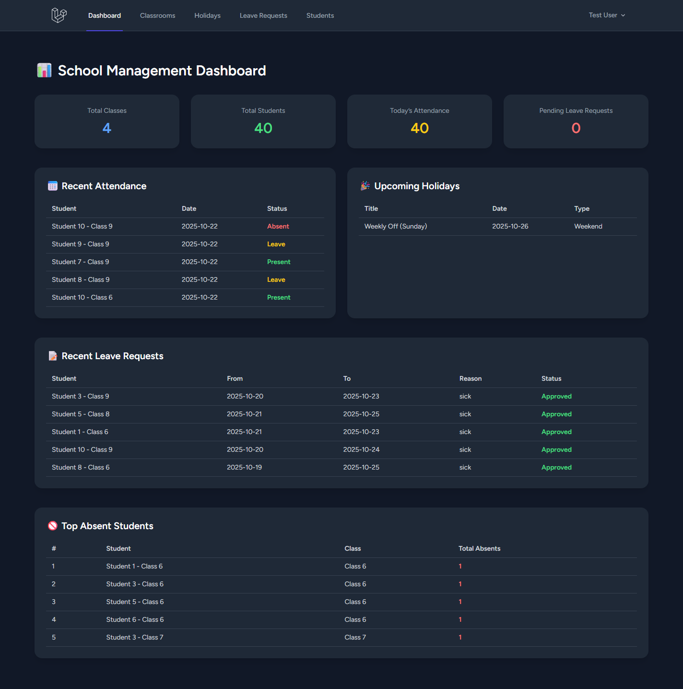

# Attendance System  
A Laravel-based attendance management system for educational institutions.  
This system allows you to manage classes, students, daily attendance, holidays and leave requests through a friendly web interface.

# Screenshot  


## 🚀 What is this project?  
- Manage **classes** (e.g., “Class 10 – A”, section B).  
- Manage **students** assigned to each class.  
- Record **daily attendance** of each student: Present, Absent, Late, Leave, Holiday.  
- Maintain a table of **holidays** so attendance isn’t recorded on those days.  
- Allow students to submit **leave requests** (sick, personal, emergency, other), and admin can approve or reject.  
- A **dashboard overview** to see totals and key metrics: total classes, total students, today’s attendance, pending leaves, top absent students.  
- View **monthly attendance sheets** and **individual student summaries**.

## ✅ Features  
- CRUD for Classes, Students, Attendance, Holidays, LeaveRequests using Laravel models & controllers.  
- Nested routes (example: `classrooms/{classroom}/attendances`) for class-wise attendance.  
- Blade views styled with TailwindCSS (dark mode ready) for modern UI.  
- Attendance marking via modal for quick input (status + remarks).  
- Monthly filter for attendance sheets and summary views.  
- Simple logic ensuring one attendance record per student per date (updateOrCreate).  
- Leave request workflow including status management.  
- Dashboard cards and tables to show recent activities & summary metrics.

## 📦 Tech Stack  
- Laravel (PHP), MySQL (or any supported database)  
- TailwindCSS for frontend styling  
- Blade templating engine for UI  
- Eloquent ORM for models and relationships  
- Laravel migrations and seeders for database schema and dummy data  

## 🛠 Setup Instructions  
Follow these steps to get the project up and running locally:

1. **Clone the repository**  
   ```bash
   git clone https://github.com/mimranlahoori/attendance_system.git
   cd attendance_system
   ```

2. **Install dependencies**

   ```bash
   composer install
   npm install
   ```

3. **Copy and configure `.env`**

   ```bash
   cp .env.example .env
   ```

   Then edit `.env` to set your database credentials, e.g.:

   ```
   DB_CONNECTION=mysql
   DB_HOST=127.0.0.1
   DB_PORT=3306
   DB_DATABASE=attendance_system
   DB_USERNAME=root
   DB_PASSWORD=your_password
   ```

4. **Generate application key**

   ```bash
   php artisan key:generate
   ```

5. **Run migrations and seeders**

   ```bash
   php artisan migrate --seed
   ```

   This will create the necessary tables and insert some dummy data for testing.

6. **Compile frontend assets**

   ```bash
   npm run build
   ```

   Or during development:

   ```bash
   npm run dev
   ```

7. **Start local development server**

   ```bash
   php artisan serve
   ```

   Then open `http://127.0.0.1:8000` in your browser.

8. **Login / Register**
   Depending on your setup, register a user or use provided dummy credentials (if any). Then you can access the modules: Classes, Students, Attendance, Holidays, Leaves, and Dashboard.

## 📁 Project Structure

```
app/
  Models/
    Classroom.php
    Student.php
    Attendance.php
    Holiday.php
    LeaveRequest.php
  Http/
    Controllers/
      ClassroomController.php
      StudentController.php
      AttendanceController.php
      HolidayController.php
      LeaveRequestController.php
      DashboardController.php
database/
  migrations/
  seeders/
resources/
  views/
    classrooms/
    students/
    attendances/
    holidays/
    leaves/
    dashboard.blade.php
routes/
  web.php
```

## 🔍 Usage Highlights

* Go to **Classes** → Add or manage classroom entries.
* Go to **Students** → Create new student records and assign them to a class.
* Go to **Attendance** → Choose a class, mark attendance for each student (or view sheet).
* Go to **Holidays** → Define holiday dates so they are excluded from attendance.
* Go to **Leaves** → Students submit leave requests; admin reviews/approves/rejects.
* Go to **Dashboard** → Get overview of system stats, recent activity and top absentees.

## 🙌 Contributing

Feel free to fork the project and submit pull requests. Some possible enhancements:

* Bulk/class-wise attendance marking (checkbox grid)
* Role-based access (Admin, Teacher, Student)
* Dashboard charts (attendance trends, heatmaps)
* Export to CSV/PDF reports
* Email/SMS notifications for leave approval or absentees

## 📄 License

This project is open-source and available under the MIT License.
See `LICENSE` for details.

